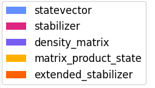

### Title
"Exploring Quantum Entanglement: Simulation of a Bell State Using Various Quantum Computation Methods"

### Abstract
This paper presents a study on the simulation of quantum entanglement through the preparation of a Bell state using the Qiskit Aer simulator. We explore the effects of utilizing different quantum simulation methods, including statevector, stabilizer, density matrix, matrix product state, and extended stabilizer, to demonstrate the quantum superposition and entanglement properties. The results provide insights into the practical implementations of quantum states for educational purposes and demonstrate the versatility of the Qiskit framework.

### Introduction
Quantum entanglement is a fundamental aspect of quantum mechanics, where particles become intertwined and the state of one cannot be described without the state of the other, regardless of the distance between them. This paper investigates the Bell state, a simple quantum system of two entangled qubits, utilizing various simulation methods provided by the Qiskit Aer environment. The aim is to demonstrate how different quantum simulation methods can affect the outcome and interpretation of quantum states in a noise-free simulation environment.

### Methods
#### Tools and Frameworks
We employed Qiskit, an open-source quantum computing software development framework, to create and simulate quantum circuits. The `AerSimulator` from Qiskit Aer was used for running simulations with different backend methods.

#### Circuit Design
The quantum circuit was designed with two qubits: the first qubit was subjected to a Hadamard gate to create a superposition, followed by a controlled-NOT (CNOT) gate to entangle it with the second qubit. This setup is known to produce a Bell state.

#### Simulation Methods
The circuit was simulated using the following methods:
- **Statevector**: Computes the final statevector of the quantum state after the application of the quantum circuit.
- **Stabilizer**: Utilizes the stabilizer formalism to simulate quantum circuits efficiently, suitable for circuits consisting only of Clifford gates.
- **Density Matrix**: Provides the density matrix of the quantum state, useful for understanding decoherence.
- **Matrix Product State**: Employs a chain of tensors to represent the quantum state, efficient for one-dimensional quantum systems.
- **Extended Stabilizer**: Simulates quantum circuits approximately using a quasi-probability representation of quantum states.

### Results
The simulation results are presented as histograms showing the probability distribution of measurement outcomes for each simulation method. These visualizations highlight the similarities and differences in how each method processes and outputs the state information.

### Discussion
The comparison across different methods revealed that while all methods correctly simulate the ideal Bell state under noise-free conditions, the underlying representations and computational complexities differ. This has implications for the choice of simulation method based on the specific requirements of quantum algorithms, including computational resources and desired fidelity.

### Conclusion
This study underscores the versatility and robustness of the Qiskit Aer simulator in handling different quantum computation methods to simulate a fundamental quantum state. The results demonstrate the practical utility of quantum simulations in educational settings, providing a hands-on approach to understanding complex quantum phenomena such as entanglement.

### Figures
Include plots generated by the `plot_histogram` function showing the outcome probabilities for the Bell state under different simulation methods.

### References
1. Qiskit: An Open-source Framework for Quantum Computing (Provide link to documentation or original publication).
2. Nielsen, M. A., & Chuang, I. L. (2010). Quantum Computation and Quantum Information.